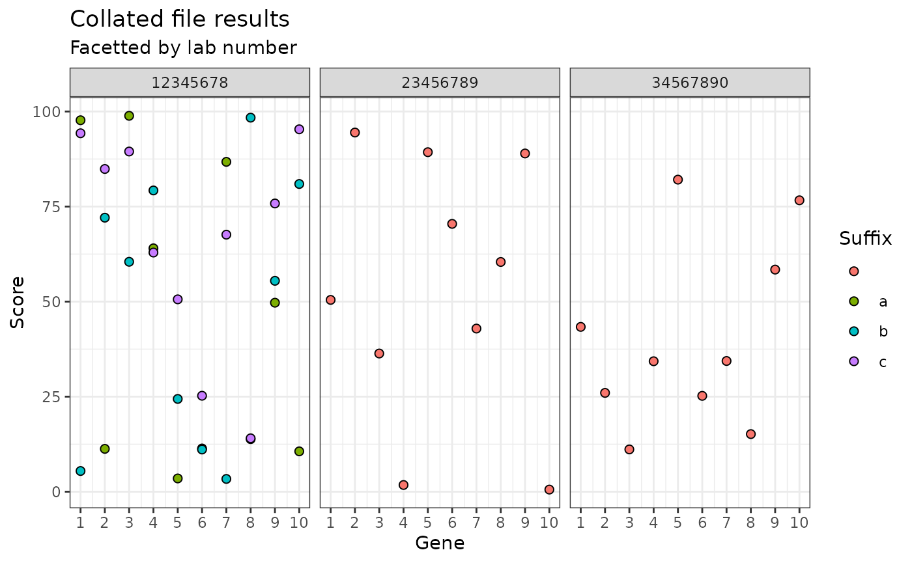

# Exploratory data analysis with labtools

``` r

library(labtools)
library(readr)
library(purrr)
library(ggplot2)
library(dplyr)
#> 
#> Attaching package: 'dplyr'
#> The following objects are masked from 'package:stats':
#> 
#>     filter, lag
#> The following objects are masked from 'package:base':
#> 
#>     intersect, setdiff, setequal, union
```

## The problem

There are multiple files with genetic results in, and the sample
identifiers are only in the filenames.

``` r


files <- list.files(path = "data/",
           pattern = ".*.csv",
           full.names = TRUE)

files
#> [1] "data//WS123456_12345678a_PierreBEZUKHOV.csv"
#> [2] "data//WS123456_12345678b_PierreBEZUKHOV.csv"
#> [3] "data//WS123456_12345678c_PierreBEZUKHOV.csv"
#> [4] "data//WS123456_23456789_AnnaKARENINA.csv"   
#> [5] "data//WS123456_34567890_IvanILYCH.csv"
```

Each file consists of results for different genes.

For the purpose of this example, I have randomly generated a “score” for
each gene. This is not real clinical data.

    #> # A tibble: 10 × 2
    #>    gene   score
    #>    <chr>  <dbl>
    #>  1 gene1  97.7 
    #>  2 gene2  11.3 
    #>  3 gene3  98.9 
    #>  4 gene4  64.0 
    #>  5 gene5   3.49
    #>  6 gene6  11.4 
    #>  7 gene7  86.8 
    #>  8 gene8  13.8 
    #>  9 gene9  49.7 
    #> 10 gene10 10.6

I want to get all the results into one dataframe, along with all the
relevant identifiers.

## The solution

I can do this for a single file using the `read_csv_with_filename`
function from `labtools`.

``` r


read_csv_with_filename(files[1])
#> Rows: 10 Columns: 2
#> ── Column specification ────────────────────────────────────────────────────────
#> Delimiter: ","
#> chr (1): gene
#> dbl (1): score
#> 
#> ℹ Use `spec()` to retrieve the full column specification for this data.
#> ℹ Specify the column types or set `show_col_types = FALSE` to quiet this message.
#> # A tibble: 10 × 4
#>    gene   score filepath                                    filename            
#>    <chr>  <dbl> <chr>                                       <chr>               
#>  1 gene1  97.7  data//WS123456_12345678a_PierreBEZUKHOV.csv WS123456_12345678a_…
#>  2 gene2  11.3  data//WS123456_12345678a_PierreBEZUKHOV.csv WS123456_12345678a_…
#>  3 gene3  98.9  data//WS123456_12345678a_PierreBEZUKHOV.csv WS123456_12345678a_…
#>  4 gene4  64.0  data//WS123456_12345678a_PierreBEZUKHOV.csv WS123456_12345678a_…
#>  5 gene5   3.49 data//WS123456_12345678a_PierreBEZUKHOV.csv WS123456_12345678a_…
#>  6 gene6  11.4  data//WS123456_12345678a_PierreBEZUKHOV.csv WS123456_12345678a_…
#>  7 gene7  86.8  data//WS123456_12345678a_PierreBEZUKHOV.csv WS123456_12345678a_…
#>  8 gene8  13.8  data//WS123456_12345678a_PierreBEZUKHOV.csv WS123456_12345678a_…
#>  9 gene9  49.7  data//WS123456_12345678a_PierreBEZUKHOV.csv WS123456_12345678a_…
#> 10 gene10 10.6  data//WS123456_12345678a_PierreBEZUKHOV.csv WS123456_12345678a_…
```

Using `map` from `purrr` I can then iterate this function over the file
list and bind the data together.

``` r


all_data <- files |> 
  map(\(files) read_csv_with_filename(files)) |> 
  list_rbind() |> 
  mutate_ids() |> 
  mutate(gene_number = parse_number(gene))
#> Rows: 10 Columns: 2
#> ── Column specification ────────────────────────────────────────────────────────
#> Delimiter: ","
#> chr (1): gene
#> dbl (1): score
#> 
#> ℹ Use `spec()` to retrieve the full column specification for this data.
#> ℹ Specify the column types or set `show_col_types = FALSE` to quiet this message.
#> Rows: 10 Columns: 2
#> ── Column specification ────────────────────────────────────────────────────────
#> Delimiter: ","
#> chr (1): gene
#> dbl (1): score
#> 
#> ℹ Use `spec()` to retrieve the full column specification for this data.
#> ℹ Specify the column types or set `show_col_types = FALSE` to quiet this message.
#> Rows: 10 Columns: 2
#> ── Column specification ────────────────────────────────────────────────────────
#> Delimiter: ","
#> chr (1): gene
#> dbl (1): score
#> 
#> ℹ Use `spec()` to retrieve the full column specification for this data.
#> ℹ Specify the column types or set `show_col_types = FALSE` to quiet this message.
#> Rows: 10 Columns: 2
#> ── Column specification ────────────────────────────────────────────────────────
#> Delimiter: ","
#> chr (1): gene
#> dbl (1): score
#> 
#> ℹ Use `spec()` to retrieve the full column specification for this data.
#> ℹ Specify the column types or set `show_col_types = FALSE` to quiet this message.
#> Rows: 10 Columns: 2
#> ── Column specification ────────────────────────────────────────────────────────
#> Delimiter: ","
#> chr (1): gene
#> dbl (1): score
#> 
#> ℹ Use `spec()` to retrieve the full column specification for this data.
#> ℹ Specify the column types or set `show_col_types = FALSE` to quiet this message.
```

This gives me the data in a single dataframe with each row annotated
with the correct sample identifiers.

| gene | score | filepath | filename | labno | suffix | worksheet | labno_suffix | labno_suffix_worksheet | gene_number |
|:---|---:|:---|:---|:---|:---|:---|:---|:---|---:|
| gene1 | 97.6955141 | data//WS123456_12345678a_PierreBEZUKHOV.csv | WS123456_12345678a_PierreBEZUKHOV.csv | 12345678 | a | WS123456 | 12345678a | 12345678a_WS123456 | 1 |
| gene2 | 11.2687355 | data//WS123456_12345678a_PierreBEZUKHOV.csv | WS123456_12345678a_PierreBEZUKHOV.csv | 12345678 | a | WS123456 | 12345678a | 12345678a_WS123456 | 2 |
| gene3 | 98.8593290 | data//WS123456_12345678a_PierreBEZUKHOV.csv | WS123456_12345678a_PierreBEZUKHOV.csv | 12345678 | a | WS123456 | 12345678a | 12345678a_WS123456 | 3 |
| gene4 | 64.0114902 | data//WS123456_12345678a_PierreBEZUKHOV.csv | WS123456_12345678a_PierreBEZUKHOV.csv | 12345678 | a | WS123456 | 12345678a | 12345678a_WS123456 | 4 |
| gene5 | 3.4885046 | data//WS123456_12345678a_PierreBEZUKHOV.csv | WS123456_12345678a_PierreBEZUKHOV.csv | 12345678 | a | WS123456 | 12345678a | 12345678a_WS123456 | 5 |
| gene6 | 11.3642443 | data//WS123456_12345678a_PierreBEZUKHOV.csv | WS123456_12345678a_PierreBEZUKHOV.csv | 12345678 | a | WS123456 | 12345678a | 12345678a_WS123456 | 6 |
| gene7 | 86.7547998 | data//WS123456_12345678a_PierreBEZUKHOV.csv | WS123456_12345678a_PierreBEZUKHOV.csv | 12345678 | a | WS123456 | 12345678a | 12345678a_WS123456 | 7 |
| gene8 | 13.8269989 | data//WS123456_12345678a_PierreBEZUKHOV.csv | WS123456_12345678a_PierreBEZUKHOV.csv | 12345678 | a | WS123456 | 12345678a | 12345678a_WS123456 | 8 |
| gene9 | 49.7064066 | data//WS123456_12345678a_PierreBEZUKHOV.csv | WS123456_12345678a_PierreBEZUKHOV.csv | 12345678 | a | WS123456 | 12345678a | 12345678a_WS123456 | 9 |
| gene10 | 10.6104016 | data//WS123456_12345678a_PierreBEZUKHOV.csv | WS123456_12345678a_PierreBEZUKHOV.csv | 12345678 | a | WS123456 | 12345678a | 12345678a_WS123456 | 10 |
| gene1 | 5.4439993 | data//WS123456_12345678b_PierreBEZUKHOV.csv | WS123456_12345678b_PierreBEZUKHOV.csv | 12345678 | b | WS123456 | 12345678b | 12345678b_WS123456 | 1 |
| gene2 | 72.0719737 | data//WS123456_12345678b_PierreBEZUKHOV.csv | WS123456_12345678b_PierreBEZUKHOV.csv | 12345678 | b | WS123456 | 12345678b | 12345678b_WS123456 | 2 |
| gene3 | 60.4684200 | data//WS123456_12345678b_PierreBEZUKHOV.csv | WS123456_12345678b_PierreBEZUKHOV.csv | 12345678 | b | WS123456 | 12345678b | 12345678b_WS123456 | 3 |
| gene4 | 79.2336205 | data//WS123456_12345678b_PierreBEZUKHOV.csv | WS123456_12345678b_PierreBEZUKHOV.csv | 12345678 | b | WS123456 | 12345678b | 12345678b_WS123456 | 4 |
| gene5 | 24.4005622 | data//WS123456_12345678b_PierreBEZUKHOV.csv | WS123456_12345678b_PierreBEZUKHOV.csv | 12345678 | b | WS123456 | 12345678b | 12345678b_WS123456 | 5 |
| gene6 | 11.0944414 | data//WS123456_12345678b_PierreBEZUKHOV.csv | WS123456_12345678b_PierreBEZUKHOV.csv | 12345678 | b | WS123456 | 12345678b | 12345678b_WS123456 | 6 |
| gene7 | 3.3582193 | data//WS123456_12345678b_PierreBEZUKHOV.csv | WS123456_12345678b_PierreBEZUKHOV.csv | 12345678 | b | WS123456 | 12345678b | 12345678b_WS123456 | 7 |
| gene8 | 98.3774984 | data//WS123456_12345678b_PierreBEZUKHOV.csv | WS123456_12345678b_PierreBEZUKHOV.csv | 12345678 | b | WS123456 | 12345678b | 12345678b_WS123456 | 8 |
| gene9 | 55.4686784 | data//WS123456_12345678b_PierreBEZUKHOV.csv | WS123456_12345678b_PierreBEZUKHOV.csv | 12345678 | b | WS123456 | 12345678b | 12345678b_WS123456 | 9 |
| gene10 | 80.9327019 | data//WS123456_12345678b_PierreBEZUKHOV.csv | WS123456_12345678b_PierreBEZUKHOV.csv | 12345678 | b | WS123456 | 12345678b | 12345678b_WS123456 | 10 |
| gene1 | 94.2702363 | data//WS123456_12345678c_PierreBEZUKHOV.csv | WS123456_12345678c_PierreBEZUKHOV.csv | 12345678 | c | WS123456 | 12345678c | 12345678c_WS123456 | 1 |
| gene2 | 84.8811300 | data//WS123456_12345678c_PierreBEZUKHOV.csv | WS123456_12345678c_PierreBEZUKHOV.csv | 12345678 | c | WS123456 | 12345678c | 12345678c_WS123456 | 2 |
| gene3 | 89.4712796 | data//WS123456_12345678c_PierreBEZUKHOV.csv | WS123456_12345678c_PierreBEZUKHOV.csv | 12345678 | c | WS123456 | 12345678c | 12345678c_WS123456 | 3 |
| gene4 | 62.9010040 | data//WS123456_12345678c_PierreBEZUKHOV.csv | WS123456_12345678c_PierreBEZUKHOV.csv | 12345678 | c | WS123456 | 12345678c | 12345678c_WS123456 | 4 |
| gene5 | 50.5924463 | data//WS123456_12345678c_PierreBEZUKHOV.csv | WS123456_12345678c_PierreBEZUKHOV.csv | 12345678 | c | WS123456 | 12345678c | 12345678c_WS123456 | 5 |
| gene6 | 25.2354199 | data//WS123456_12345678c_PierreBEZUKHOV.csv | WS123456_12345678c_PierreBEZUKHOV.csv | 12345678 | c | WS123456 | 12345678c | 12345678c_WS123456 | 6 |
| gene7 | 67.6015973 | data//WS123456_12345678c_PierreBEZUKHOV.csv | WS123456_12345678c_PierreBEZUKHOV.csv | 12345678 | c | WS123456 | 12345678c | 12345678c_WS123456 | 7 |
| gene8 | 14.0432803 | data//WS123456_12345678c_PierreBEZUKHOV.csv | WS123456_12345678c_PierreBEZUKHOV.csv | 12345678 | c | WS123456 | 12345678c | 12345678c_WS123456 | 8 |
| gene9 | 75.8114634 | data//WS123456_12345678c_PierreBEZUKHOV.csv | WS123456_12345678c_PierreBEZUKHOV.csv | 12345678 | c | WS123456 | 12345678c | 12345678c_WS123456 | 9 |
| gene10 | 95.3160182 | data//WS123456_12345678c_PierreBEZUKHOV.csv | WS123456_12345678c_PierreBEZUKHOV.csv | 12345678 | c | WS123456 | 12345678c | 12345678c_WS123456 | 10 |
| gene1 | 50.4452151 | data//WS123456_23456789_AnnaKARENINA.csv | WS123456_23456789_AnnaKARENINA.csv | 23456789 |  | WS123456 | 23456789 | 23456789_WS123456 | 1 |
| gene2 | 94.4651708 | data//WS123456_23456789_AnnaKARENINA.csv | WS123456_23456789_AnnaKARENINA.csv | 23456789 |  | WS123456 | 23456789 | 23456789_WS123456 | 2 |
| gene3 | 36.3450093 | data//WS123456_23456789_AnnaKARENINA.csv | WS123456_23456789_AnnaKARENINA.csv | 23456789 |  | WS123456 | 23456789 | 23456789_WS123456 | 3 |
| gene4 | 1.7642395 | data//WS123456_23456789_AnnaKARENINA.csv | WS123456_23456789_AnnaKARENINA.csv | 23456789 |  | WS123456 | 23456789 | 23456789_WS123456 | 4 |
| gene5 | 89.2965208 | data//WS123456_23456789_AnnaKARENINA.csv | WS123456_23456789_AnnaKARENINA.csv | 23456789 |  | WS123456 | 23456789 | 23456789_WS123456 | 5 |
| gene6 | 70.4437311 | data//WS123456_23456789_AnnaKARENINA.csv | WS123456_23456789_AnnaKARENINA.csv | 23456789 |  | WS123456 | 23456789 | 23456789_WS123456 | 6 |
| gene7 | 42.9037774 | data//WS123456_23456789_AnnaKARENINA.csv | WS123456_23456789_AnnaKARENINA.csv | 23456789 |  | WS123456 | 23456789 | 23456789_WS123456 | 7 |
| gene8 | 60.4224573 | data//WS123456_23456789_AnnaKARENINA.csv | WS123456_23456789_AnnaKARENINA.csv | 23456789 |  | WS123456 | 23456789 | 23456789_WS123456 | 8 |
| gene9 | 88.9575026 | data//WS123456_23456789_AnnaKARENINA.csv | WS123456_23456789_AnnaKARENINA.csv | 23456789 |  | WS123456 | 23456789 | 23456789_WS123456 | 9 |
| gene10 | 0.5565599 | data//WS123456_23456789_AnnaKARENINA.csv | WS123456_23456789_AnnaKARENINA.csv | 23456789 |  | WS123456 | 23456789 | 23456789_WS123456 | 10 |
| gene1 | 43.3481782 | data//WS123456_34567890_IvanILYCH.csv | WS123456_34567890_IvanILYCH.csv | 34567890 |  | WS123456 | 34567890 | 34567890_WS123456 | 1 |
| gene2 | 25.9921850 | data//WS123456_34567890_IvanILYCH.csv | WS123456_34567890_IvanILYCH.csv | 34567890 |  | WS123456 | 34567890 | 34567890_WS123456 | 2 |
| gene3 | 11.1211967 | data//WS123456_34567890_IvanILYCH.csv | WS123456_34567890_IvanILYCH.csv | 34567890 |  | WS123456 | 34567890 | 34567890_WS123456 | 3 |
| gene4 | 34.3106907 | data//WS123456_34567890_IvanILYCH.csv | WS123456_34567890_IvanILYCH.csv | 34567890 |  | WS123456 | 34567890 | 34567890_WS123456 | 4 |
| gene5 | 82.0752608 | data//WS123456_34567890_IvanILYCH.csv | WS123456_34567890_IvanILYCH.csv | 34567890 |  | WS123456 | 34567890 | 34567890_WS123456 | 5 |
| gene6 | 25.2085669 | data//WS123456_34567890_IvanILYCH.csv | WS123456_34567890_IvanILYCH.csv | 34567890 |  | WS123456 | 34567890 | 34567890_WS123456 | 6 |
| gene7 | 34.3805890 | data//WS123456_34567890_IvanILYCH.csv | WS123456_34567890_IvanILYCH.csv | 34567890 |  | WS123456 | 34567890 | 34567890_WS123456 | 7 |
| gene8 | 15.1524318 | data//WS123456_34567890_IvanILYCH.csv | WS123456_34567890_IvanILYCH.csv | 34567890 |  | WS123456 | 34567890 | 34567890_WS123456 | 8 |
| gene9 | 58.4151974 | data//WS123456_34567890_IvanILYCH.csv | WS123456_34567890_IvanILYCH.csv | 34567890 |  | WS123456 | 34567890 | 34567890_WS123456 | 9 |
| gene10 | 76.6390498 | data//WS123456_34567890_IvanILYCH.csv | WS123456_34567890_IvanILYCH.csv | 34567890 |  | WS123456 | 34567890 | 34567890_WS123456 | 10 |

Then I can explore this collated data using `ggplot2`.



## The rationale

`labtools` is designed to help me do exploratory data analysis on
multiple files quickly and reproducibly. It is built around `tidyverse`
packages including `stringr`, `readr` and `dplyr`.

`labtools` aims to include functionality which is shared across multiple
projects that I do. This is shown in the above example: a common problem
is collating data from files which include identifiers in the filenames
with a consistent format for worksheet, lab number and suffix.

## What about extracting patient names?

There is currently no function for extracting patient names in
`labtools` for the following reasons:

- **Patient names are not always included in filenames.** If data is
  analysed on the cloud, then patient names are removed from filenames,
  which means you can have files with a mixture of patient names and no
  patient names depending on how they were processed.

- **Not all samples are from people.** Some samples are control samples,
  such as mixtures of different DNA samples or cell lines. These samples
  may be given a “name” or they may not, and the name may or may not
  follow the standard format of “forename surname”. Example:
  “HorizonPositiveControl”.

- **Some samples may be for research.** Patient samples collected for
  research will be anonymised, and the research identifier may be
  included in place of the sample name. The research identifier may also
  include numbers or other non-letter characters. Example: “study0001”

These reasons mean that designing a regular expression to identify a
patient name in a filename is complicated. One option is to use the
position of the name in the string relative to more consistent
identifiers, like lab number and worksheet number, but this is then
inflexible when the order of identifiers changes.
